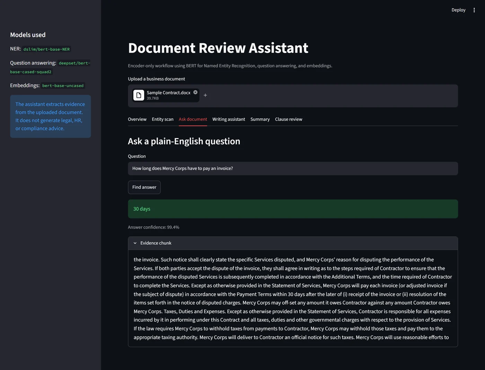
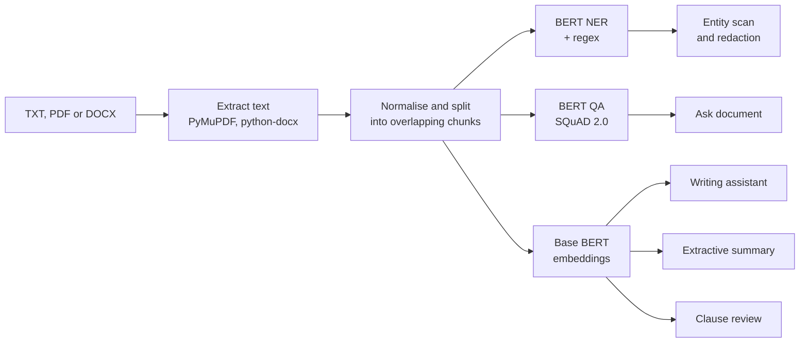
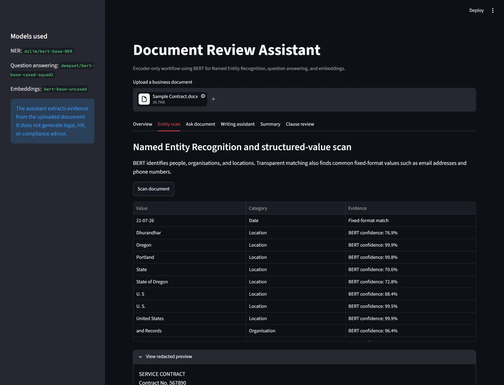
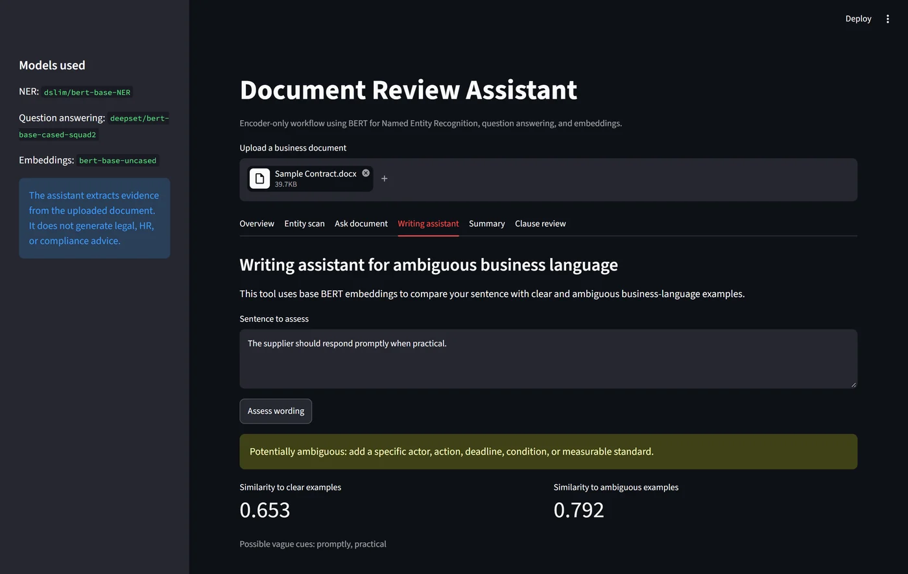
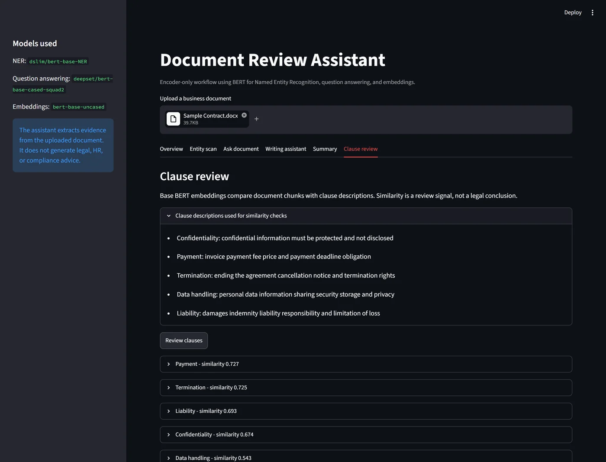

<div align="center">

# BERT Document Review

A document review assistant for contracts and business documents, built only from BERT encoders.<br>
It finds names and personal data, answers questions with spans quoted from the document, flags vague wording, summarises and points to key clauses.

[![Python][badge-python]][link-python]
[![PyTorch][badge-pytorch]][link-pytorch]
[![Hugging Face][badge-hf]][link-hf]
[![Streamlit][badge-streamlit]][link-streamlit]
[![uv][badge-uv]][link-uv]
[![License: MIT][badge-license]](LICENSE)



<sub>Asking the sample service contract a question. The answer is a span of the contract, shown with the passage it came from.</sub>

</div>

## About

Language models that write their own answers can state things a document never says. For review work that is the wrong failure mode, so this assistant uses no generative model at all. Every output is either a label on the source text, a span copied out of it, or a similarity score, and each one comes with the evidence it is based on.

It runs three BERT models:

| Role | Model | Used for |
|---|---|---|
| Named entity recognition | [`dslim/bert-base-NER`](https://huggingface.co/dslim/bert-base-NER) | people, organisations and locations |
| Extractive question answering | [`deepset/bert-base-cased-squad2`](https://huggingface.co/deepset/bert-base-cased-squad2) | answering questions with a span from the document |
| Sentence embeddings | [`bert-base-uncased`](https://huggingface.co/bert-base-uncased) | the writing assistant, the summary and clause review |

## How it works



Text comes out of PDFs with PyMuPDF and out of Word files with python-docx, including table cells, which are flattened into `Table n: cell | cell` rows so a signature block stays readable. BERT reads at most 512 tokens at a time, so the text is split into chunks of 230 words that overlap by 35, and a sentence on a chunk boundary is always seen whole in one of them.

### Entity scan

<p align="center">
  
</p>

The NER model labels people, organisations and locations in every chunk, keeping whole words with a confidence of at least 0.6. Regular expressions add the values that have a fixed format: email addresses, phone numbers, employee IDs and dates. The redacted preview replaces every finding with its category, such as `[PERSON]` or `[DATE]`, matching whole words only.

### Ask document

The question and each chunk go through the SQuAD 2.0 model, which scores every possible start and end token of an answer. SQuAD 2.0 includes questions that have no answer, so the model also produces a no-answer score from its `[CLS]` token. A span is accepted only if it beats that score, and the best accepted span across all chunks is returned with the chunk it came from. Its confidence is the sigmoid of the margin over the no-answer score: a measure of how clearly the model preferred the span, not a probability that it is correct.

When the model finds nothing and the question asks for a name, a fallback looks for `Organisation | Name: ... | Title: ...` rows in the flattened tables and returns the name whose organisation and title both appear in the question.

### Writing assistant

<p align="center">
  
</p>

A sentence is embedded (mean-pooled over tokens, then normalised) and compared by cosine similarity with three examples of specific contract language and four vague ones. It is flagged as potentially ambiguous if it sits closer to the vague group or contains a cue word such as "promptly", "reasonable", "as needed" or "good faith".

### Extractive summary

Every sentence is embedded and the normalised mean of those vectors stands for the document as a whole. The sentences closest to it are returned in their original order, so the summary only ever contains sentences from the document.

### Clause review

<p align="center">
  
</p>

The document is cut into 90-word chunks and each one is compared with short descriptions of five clause types: confidentiality, payment, termination, data handling and liability. For each type, the closest chunk is shown as the place to start reading.

## Running it

The project uses [uv](https://docs.astral.sh/uv/) and Python 3.12.

```bash
uv sync
uv run streamlit run app.py
```

Upload a TXT, PDF or Word file. The first upload downloads the three models (about 1.3 GB) and loads them once per session. `sample_documents/Sample Contract.docx` is a service contract template from Mercy Corps, filled in with placeholder details, to try it on.

`document_review.ipynb` runs the same pipeline step by step on the sample contract:

```bash
uv run --with jupyterlab jupyter lab document_review.ipynb
```

A CUDA GPU is used automatically when PyTorch can see one; otherwise everything runs on the CPU.

## Repository layout

```
.
├── pipeline.py               Text extraction, chunking and the BertDocumentAssistant class
├── app.py                    Streamlit interface with one tab per feature
├── document_review.ipynb     The pipeline run step by step on the sample contract
├── sample_documents/         Sample service contract
├── pyproject.toml, uv.lock   Dependencies
└── docs/images/              Screenshots used in this README
```

## Limitations

- `bert-base-NER` was trained on news text, and contracts confuse it. Capitalised defined terms such as "Services", "Work Product" and "Contractor" are tagged as organisations, so the redacted preview hides far more than personal data. A model fine-tuned on legal text, or a list of the document's defined terms, would fix most of this.
- Plain `bert-base-uncased` was never trained to make similar sentences close together, so its similarity scores sit in a narrow band (0.54 to 0.73 for the five clause types on the sample contract) and the best match is not always right: the chunk it picks for termination is about key personnel and scope changes. A sentence-embedding model such as Sentence-BERT would separate them much better.
- The ambiguity check flags any sentence containing a cue word, including "may", which appears in plenty of precise clauses.
- Scanned PDFs have no text layer and need OCR first.
- It is a review aid. It does not give legal, HR or compliance advice, and every finding needs a person to check it.

## License

Released under the [MIT License](LICENSE). The model weights keep their own licences on Hugging Face.

## Author

Made by Rudra Somaiya.

[![GitHub][badge-github]][link-github]
[![LinkedIn][badge-linkedin]][link-linkedin]

[badge-python]: https://img.shields.io/badge/Python_3.12-3776AB?style=for-the-badge&logo=python&logoColor=white
[badge-pytorch]: https://img.shields.io/badge/PyTorch-EE4C2C?style=for-the-badge&logo=pytorch&logoColor=white
[badge-hf]: https://img.shields.io/badge/Transformers-FFD21E?style=for-the-badge&logo=huggingface&logoColor=black
[badge-streamlit]: https://img.shields.io/badge/Streamlit-FF4B4B?style=for-the-badge&logo=streamlit&logoColor=white
[badge-uv]: https://img.shields.io/badge/uv-DE5FE9?style=for-the-badge&logo=uv&logoColor=white
[badge-license]: https://img.shields.io/badge/License-MIT-F7DF1E?style=for-the-badge
[badge-github]: https://img.shields.io/badge/GitHub-RudraSomaiya-181717?style=for-the-badge&logo=github&logoColor=white
[badge-linkedin]: https://img.shields.io/badge/LinkedIn-Rudra_Somaiya-0A66C2?style=for-the-badge&logo=data:image/svg%2bxml;base64,PHN2ZyB4bWxucz0iaHR0cDovL3d3dy53My5vcmcvMjAwMC9zdmciIHZpZXdCb3g9IjAgMCAyNCAyNCI+PHBhdGggZmlsbD0iI2ZmZiIgZD0iTTIwLjQ1IDIwLjQ1aC0zLjU2di01LjU3YzAtMS4zMy0uMDItMy4wNC0xLjg1LTMuMDQtMS44NSAwLTIuMTQgMS40NS0yLjE0IDIuOTR2NS42N0g5LjM1VjloMy40MXYxLjU2aC4wNWMuNDgtLjkgMS42NC0xLjg1IDMuMzctMS44NSAzLjYgMCA0LjI3IDIuMzcgNC4yNyA1LjQ2djYuMjh6TTUuMzQgNy40M2EyLjA2IDIuMDYgMCAxIDEgMC00LjEyIDIuMDYgMi4wNiAwIDAgMSAwIDQuMTJ6TTcuMTIgMjAuNDVIMy41NlY5aDMuNTZ2MTEuNDV6TTIyLjIyIDBIMS43N0MuNzkgMCAwIC43NyAwIDEuNzN2MjAuNTRDMCAyMy4yMy43OSAyNCAxLjc3IDI0aDIwLjQ1Yy45OCAwIDEuNzgtLjc3IDEuNzgtMS43M1YxLjczQzI0IC43NyAyMy4yIDAgMjIuMjIgMHoiLz48L3N2Zz4=
[link-python]: https://www.python.org
[link-pytorch]: https://pytorch.org
[link-hf]: https://huggingface.co/docs/transformers
[link-streamlit]: https://streamlit.io
[link-uv]: https://docs.astral.sh/uv/
[link-github]: https://github.com/RudraSomaiya
[link-linkedin]: https://www.linkedin.com/in/rudra-somaiya/
